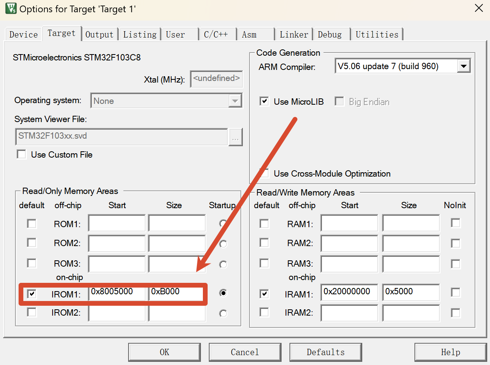

# 基于STM32的智能风扇系统

## 1、演示视频


## 2、系统硬件

- STM32F103C8T6最小系统板
- TB6612点击驱动模块
- MP1584EN电源降压模块
- 0.96寸OLED显示屏
- HC05蓝牙模块
- Encoder旋转编码器模块
- BEEP蜂鸣器模块
- DHT11温湿度传感器模块
- MQ-2烟雾检测传感器模块
- SG90舵机
- 5V小电机&风扇叶
- 12V电池
- 排针、接线端子等

## 3、系统功能

​	**（1）智能菜单系统：**

- ​	OLED菜单界面，旋转编码器+按键支持快速导航

​	**（2）四种控制模式：**

- **手动模式：**可以手动通过旋转编码器设定旋转方向、调节旋转速度、开关风扇摇头

- **自动模式：**DHT11传感器实时采集温湿度，MQ-2烟雾传感器实时检测烟雾浓度，可自动根据采集的温湿度数据开关风扇并调节风扇速度；同时若检测到烟雾时，会自主开启声光报警提示，并快速反转风扇实行排烟；同样可以手动通过旋转编码器设定合适的温湿度阈值以及检测烟雾浓度阈值

- **定时模式：**可以手动通过旋转编码器设定关闭倒计时长，旋转方向，旋转速度，是否开启风扇摇头等参数，确认后风扇会按照设定参数开始运行并倒计时，倒计时结束风扇自动停止运行

- **蓝牙模式：**可以通过“蓝牙调试器”APP远程控制实现以上三种模式的切换

## 4、补充说明

​	**（1）支持ST-Link和HC05蓝牙模块两种程序烧录方式**

​	**备注：**蓝牙串口下载软件为Microsoft Store的==MCUIAP==，并且通过HC05蓝牙串口烧录程序必须在Keil中添加修改以下内容项，：

- 开启调试生成.hex文件；

- 修改代码运行起始地址为0x8005000与偏移地址为0xB000；

- 修改 system_stm32f10x.c 文件中的宏定义 VECT_TAB_OFFSET 为 0x5000；

- Usart_Init()函数修改串口波特率为460800；

  

- 修改 Uart.c 文件中的串口中断函数如下：

  ```c
  // 标准库示例：连续判断 5 个 0xAA
  void USART1_IRQHandler(void)
  {
      static uint8_t aa_count = 0; // 静态变量，记录连续收到 0xAA 的次数
  
      if (USART_GetITStatus(USART1, USART_IT_RXNE) != RESET)
      {
          uint8_t res = USART_ReceiveData(USART1);
  
          if (res == 0xAA)
          {
              aa_count++;
              if (aa_count >= 5) // 连续收到 5 次 0xAA 才重启
              {
                  __disable_irq();
                  NVIC_SystemReset();
              }
          }
          else
          {
              aa_count = 0;       // 一旦断开连续，计数清零
              Usart_RxData = res; // 直接使用已读取的数据，避免重复读取
              Usart_SendByte(Usart_RxData);
              Usart_RxFlag = 1;
          }
          USART_ClearITPendingBit(USART1, USART_IT_RXNE);
      }
  }
  ```

- main.c 中添加：__set_PRIMASK(0);  // <--必须加：解除所有中断屏蔽

- main.c 中必须初始化：Usart_Init();
